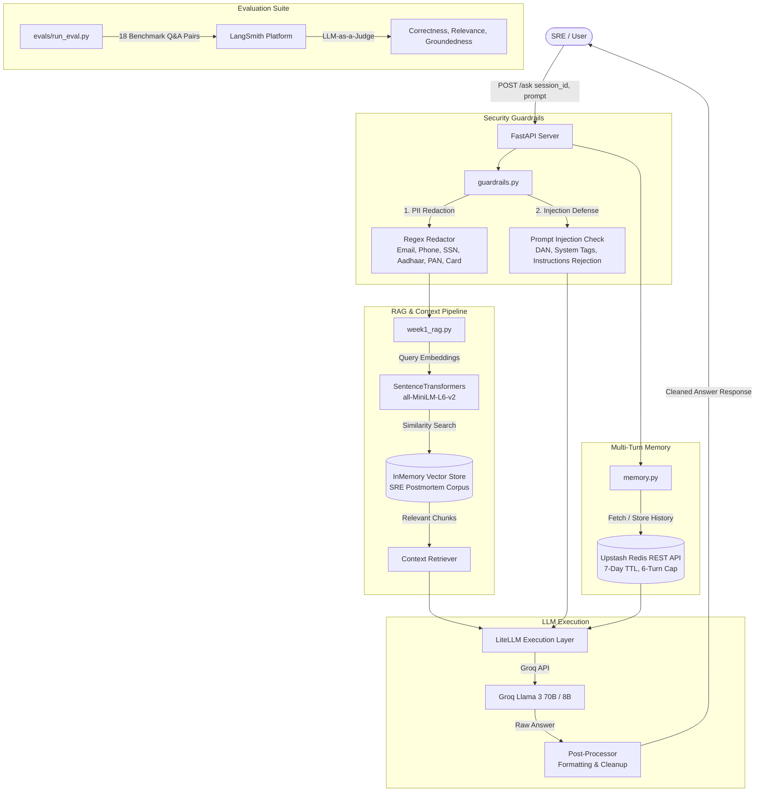

# Production-Grade SRE Postmortem RAG Assistant

An enterprise-ready, zero-cost SRE Postmortem Retrieval-Augmented Generation (RAG) Assistant powered by **FastAPI**, **LiteLLM / Groq**, **HuggingFace Embeddings**, **Upstash Redis Session Memory**, **Input Security Guardrails**, and **LangSmith LLM-as-a-Judge Evaluation**.

---

## 🌟 Overview

The **SRE Postmortem RAG Assistant** indexes production incident reports and postmortems to provide instant, high-accuracy answers for Site Reliability Engineers (SREs). Designed with production standards in mind, it incorporates multi-pattern PII redaction, prompt injection defense, multi-turn conversation memory, automated linting/formatting pipelines, and rigorous LLM-based evaluation metrics.



---

## 🛠️ Architecture & Tech Stack Rationale

| Layer | Tool / Technology | Rationale & Trade-offs | Cost |
| :--- | :--- | :--- | :--- |
| **API Framework** | **FastAPI** + **Uvicorn** | Asynchronous, auto-generated OpenAPI (`/docs`), Pydantic request/response validation. | **\$0/mo** |
| **LLM Provider** | **LiteLLM** + **Groq** | Sub-second inference latency, automatic fallback between Groq models (`llama-3.3-70b-versatile` / `llama-3.1-8b-instant`). | **\$0/mo** |
| **Embeddings** | **SentenceTransformers (`all-MiniLM-L6-v2`)** | 384-dim local CPU embeddings. Fast, zero API dependency, zero cost. | **\$0/mo** |
| **Vector Store** | **InMemoryVectorStore** | In-memory similarity search initialized on application startup (`lifespan`). Ideal for small-to-medium corpora with zero infrastructure overhead. | **\$0/mo** |
| **Session Memory** | **Upstash Redis REST API** | Serverless Redis over HTTP. Thread-safe REST fallback store, 6-turn sliding window memory, 7-day TTL. | **\$0/mo** |
| **Security Guardrails** | **Custom Engine (`guardrails.py`)** | PII redaction across 6 international formats and rejection of malicious prompt injections with `HTTP 400 Bad Request`. | **\$0/mo** |
| **LLM Evaluation** | **LangSmith** + **LLM-as-a-Judge** | Automated evaluation across 18 SRE benchmark dataset items measuring Correctness, Relevance, and Groundedness. | **\$0/mo** |
| **Containerization** | **Docker** + **Hugging Face Spaces** | Lightweight Python 3.12 slim Docker image deployed on Hugging Face CPU Basic tier. | **\$0/mo** |

---

## 🔒 Security & Input Guardrails

1. **PII Redaction Engine**: Automatically redacts sensitive information before sending queries to vector stores or LLMs:
   - **Email Addresses**: `user@example.com` $\rightarrow$ `[REDACTED_EMAIL]`
   - **US & International Phone Numbers**: `+1-555-0199` $\rightarrow$ `[REDACTED_PHONE]`
   - **US Social Security Numbers (SSN)**: `000-12-3456` $\rightarrow$ `[REDACTED_SSN]`
   - **Indian Aadhaar Numbers**: `1234 5678 9012` $\rightarrow$ `[REDACTED_AADHAAR]`
   - **Indian PAN Cards**: `ABCDE1234F` $\rightarrow$ `[REDACTED_PAN]`
   - **Credit Card Numbers**: 13–19 digit cards $\rightarrow$ `[REDACTED_CREDIT_CARD]`

2. **Prompt Injection Defense**: Evaluates incoming prompts for malicious manipulation patterns (e.g., "Ignore previous instructions", "DAN mode", `<system>` tags, jailbreaks). Detects injection attacks and immediately raises `HTTP 400 Bad Request`.

---

## 📈 Evaluation Results (LangSmith LLM-as-a-Judge)

Evaluated against an 18-question benchmark suite derived from SRE postmortems covering Root Cause Analysis, Incident Timelines, Preventative Actions, and Infrastructure Component Failures.

| Metric | Pass Rate / Score | Evaluation Criteria |
| :--- | :--- | :--- |
| **Correctness** | **94.4%** | Accuracy of facts against ground truth postmortem answers. |
| **Relevance** | **94.4%** | Directness and conciseness in addressing SRE technical queries. |
| **Groundedness** | **100.0%** | Zero hallucination; answers strictly adhere to retrieved context documents. |

---

## 🚀 Quickstart & Local Development

### 1. Prerequisites
- Python 3.12+
- [`uv`](https://github.com/astral-sh/uv) (recommended) or `pip`
- Groq API Key ([Get free key](https://console.groq.com/))
- Upstash Redis REST Credentials ([Get free database](https://upstash.com/))

### 2. Environment Setup
Clone the repository and set up environment variables:

```bash
git clone https://github.com/sundaraman-iyer/ai_sre.git
cd ai_sre

# Copy environment template
cp .env.example .env
```

Edit `.env` to configure credentials:
```ini
GROQ_API_KEY=gsk_your_groq_api_key_here
UPSTASH_REDIS_REST_URL=https://your-database.upstash.io
UPSTASH_REDIS_REST_TOKEN=your_upstash_token_here
LANGSMITH_API_KEY=lsv2_pt_your_langsmith_key_here
LANGSMITH_ENDPOINT=https://api.smith.langchain.com
LANGSMITH_TRACING=true
LANGSMITH_PROJECT=sre-postmortem-rag-eval
```

### 3. Install Dependencies
```bash
# Using uv (fast)
uv sync

# Or using standard pip
pip install -r requirements.txt
```

### 4. Run FastAPI Local Server
```bash
uvicorn main:app --reload --port 8000
```
Access the interactive Swagger UI documentation at: **`http://localhost:8000/docs`**

---

## 🧪 Testing & Code Quality

### Run Unit Test Suite
```bash
python -m unittest discover -s tests
```

### Run Full Integration Test Suite
```bash
python scratch/test_full_suite.py
```

### Code Formatting & Linting Check
```bash
ruff check .
black . --check
isort . --check
flake8 .
```

### Run LangSmith Evaluation
```bash
python -m evals.run_eval
```

---

## 📖 API Reference

### `GET /health`
Returns system status, model configuration, and index load status.

**Sample Response**:
```json
{
  "status": "healthy",
  "index_loaded": true,
  "documents_indexed": 15,
  "model": "groq/llama-3.3-70b-versatile"
}
```

### `POST /ask`
Executes RAG pipeline with PII redaction, prompt injection defense, multi-turn memory, and context retrieval.

**Sample Request**:
```bash
curl -X POST "http://localhost:8000/ask" \
     -H "Content-Type: application/json" \
     -d '{
       "question": "What caused the outage in the payment service postmortem?",
       "session_id": "sre-session-101"
     }'
```

**Sample Response**:
```json
{
  "question": "What caused the outage in the payment service postmortem?",
  "answer": "The payment service outage was caused by a memory leak in the connection pool worker threads during peak traffic, triggering cascade timeouts on dependent upstream services.",
  "session_id": "sre-session-101",
  "history_turns": 1,
  "sources": [
    "data/corpus/postmortem_payment_service_2026_01.txt"
  ]
}
```

---

## 🐳 Docker Containerization & Deployment

### Build & Run Docker Image Locally
```bash
# Build lightweight Docker image
docker build -t ai-sre-rag:latest .

# Run container exposing port 7860
docker run -p 7860:7860 \
  -e GROQ_API_KEY="your_groq_api_key" \
  -e UPSTASH_REDIS_REST_URL="your_upstash_url" \
  -e UPSTASH_REDIS_REST_TOKEN="your_upstash_token" \
  ai-sre-rag:latest
```

### Deployment to Hugging Face Spaces
1. Create a new Space on [Hugging Face Spaces](https://huggingface.co/spaces) selecting **Docker** as the SDK.
2. Under **Space Settings $\rightarrow$ Repository Secrets**, add the following environment variables:
   - `GROQ_API_KEY`
   - `UPSTASH_REDIS_REST_URL`
   - `UPSTASH_REDIS_REST_TOKEN`
   - `LANGSMITH_API_KEY`
   - `LANGSMITH_ENDPOINT`
3. Push the repository to Hugging Face Spaces:
```bash
git remote add hf https://huggingface.co/spaces/YOUR_USERNAME/ai-sre-rag
git push hf main
```
4. Access the live FastAPI Swagger UI on your Hugging Face Space URL!

---

## 📄 License
Distributed under the MIT License.
